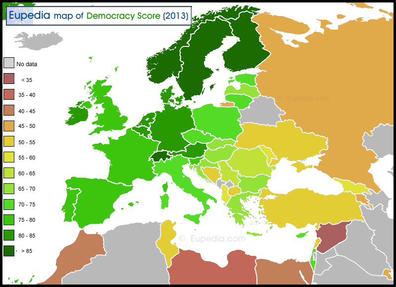

# average_joe_exotics

## Chosen Topic
Visualization of alcohol consumption, alcohol production, alcohol related deaths, traffic related deaths, and wine reviews. We are focusing our data exploration on European countries.

The main visualization will be a color map of Europe based on user's selection of base map layer with following data sets:
* Alcohol consumption
* Alcohol production
* Traffic related deaths

There will be an overlay of bubbles on each country with the radius and color dependent on mean wine review scores for that country. When the bubble is clicked, additional data will be shown for that country.

## Data Set
We have chosen an existing data set from a previous group project. [Github link to project.](https://github.com/jaime030690/mad_data)

### ERD Diagram of Metadata

## Inspiration

### Base Layer

### Bubble Layer

### Popup with Data

## Sketch of Visualization

